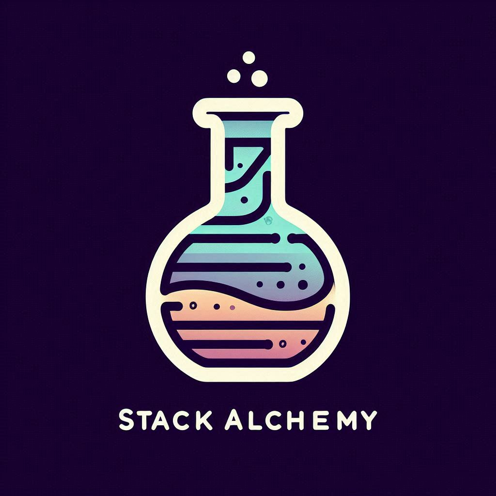
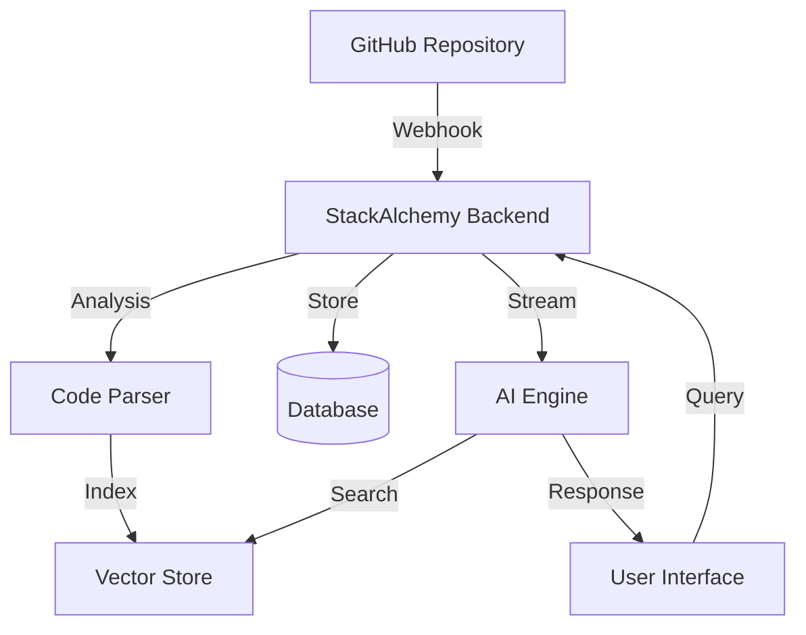

# StackAlchemy 🪴

<div align="center">
  
  <h3>Transform your repository into something magical</h3>
</div>

## Overview

StackAlchemy is an AI-powered platform that helps developers understand and navigate their codebase through natural language interactions. It provides intelligent code analysis, contextual answers, and real-time collaboration features.

## Features

- 🤖 **Natural Language Code Queries**: Ask questions about your codebase in plain English
- 📊 **Intelligent Code Analysis**: Get instant insights and references from your code
- 🔍 **Context-Aware Responses**: AI understands your project's structure and dependencies
- 💾 **Save & Share**: Save important answers and share them with your team
- 📈 **Real-time Updates**: Track commits and changes in your repository
- 🎨 **Modern UI**: Beautiful, responsive interface with dark mode support

## System Architecture



## Screenshots

<div align="center">
  
  
</div>
<div align="center">
  
  
</div>

## Getting Started

### Prerequisites

- Node.js 18+
- GitHub account
- Database (PostgreSQL recommended)

### Installation

1. Clone the repository:
```bash
git clone https://github.com/yourusername/stackalchemy.git
cd stackalchemy
```

2. Install dependencies:
```bash
npm install
```

3. Set up environment variables:
```bash
cp .env.example .env
```

4. Configure your environment variables:
```env
DATABASE_URL="postgresql://..."
GITHUB_CLIENT_ID="your_github_client_id"
GITHUB_CLIENT_SECRET="your_github_client_secret"
NEXT_PUBLIC_CLERK_PUBLISHABLE_KEY="your_clerk_key"
```

5. Run migrations:
```bash
npx prisma migrate dev
```

6. Start the development server:
```bash
npm run dev
```

## How It Works

1. **Repository Connection**: Connect your GitHub repository through our simple setup process.
2. **Code Analysis**: StackAlchemy analyzes your codebase and builds a semantic understanding of your project structure.
3. **Natural Language Interface**: Ask questions about your code in plain English through our intuitive interface.
4. **AI-Powered Responses**: Get detailed answers with relevant code files and file references.
5. **Continuous Updates**: Stay synchronized with your repository through real-time commit tracking.

## Key Components

### Frontend
- Next.js 14 with App Router
- Tailwind CSS for styling
- Clerk for authentication
- tRPC for type-safe API calls

### Backend
- Node.js with TypeScript
- Prisma for database management
- Vector database for semantic search
- Gemini 1.5 for AI processing

## Contributing

We welcome contributions! Please see our [Contributing Guide](CONTRIBUTING.md) for details.

## License

This project is licensed under the MIT License - see the [LICENSE](LICENSE) file for details.

## Support

For support, please open an issue or contact us at support@stackalchemy.com

---

<div align="center">
  Made with ❤️ by the StackAlchemy Team
</div>
# stackalchemy
# stackalchemy
# stackalchemy
