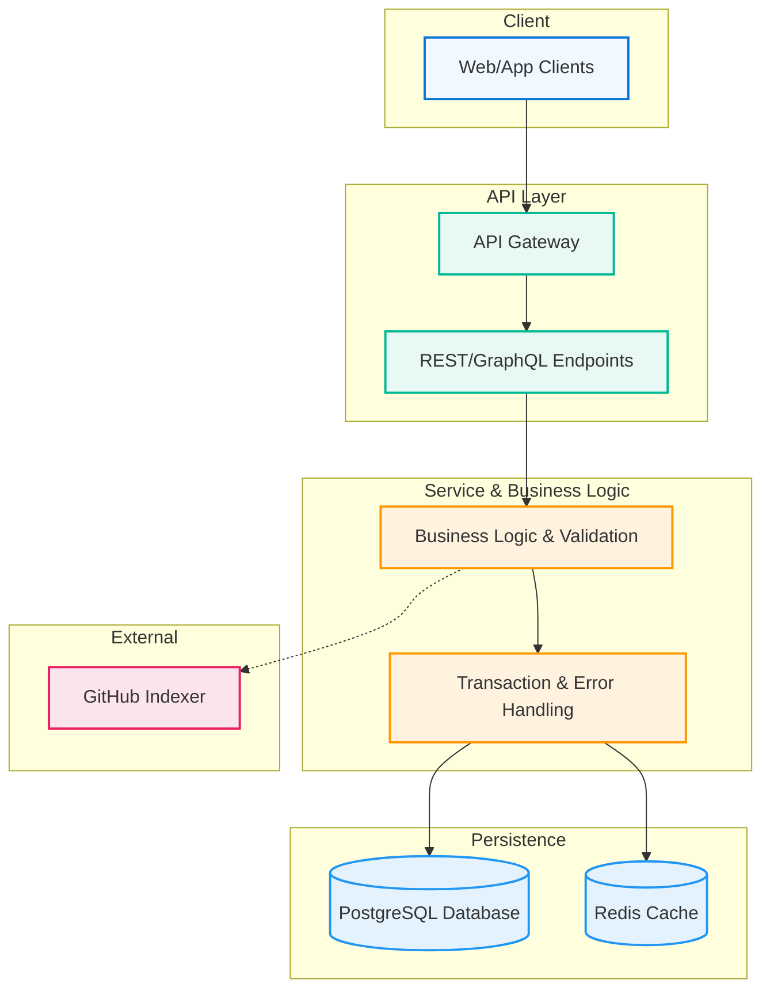
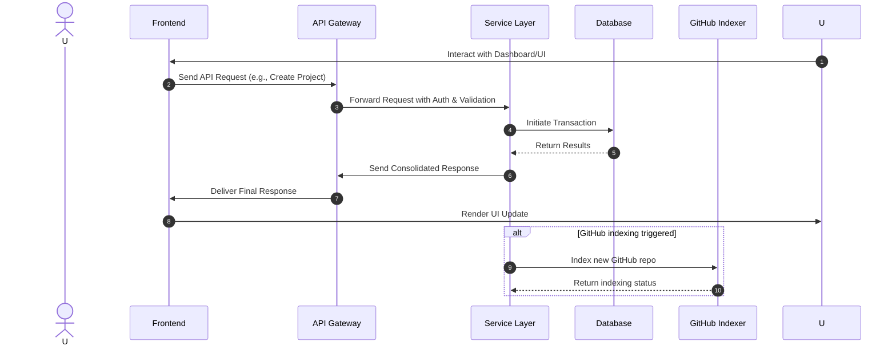
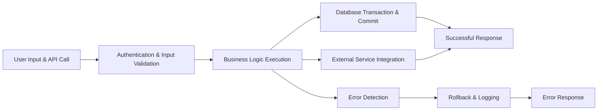
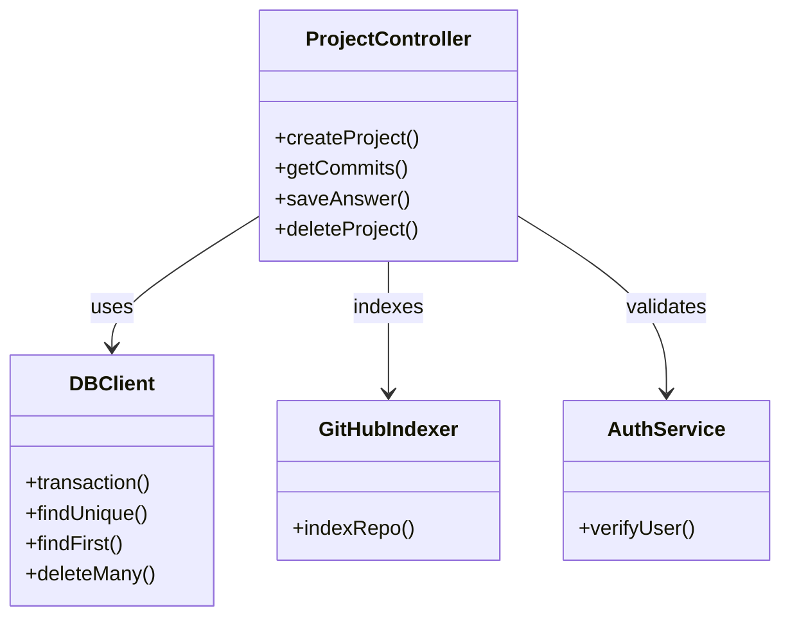
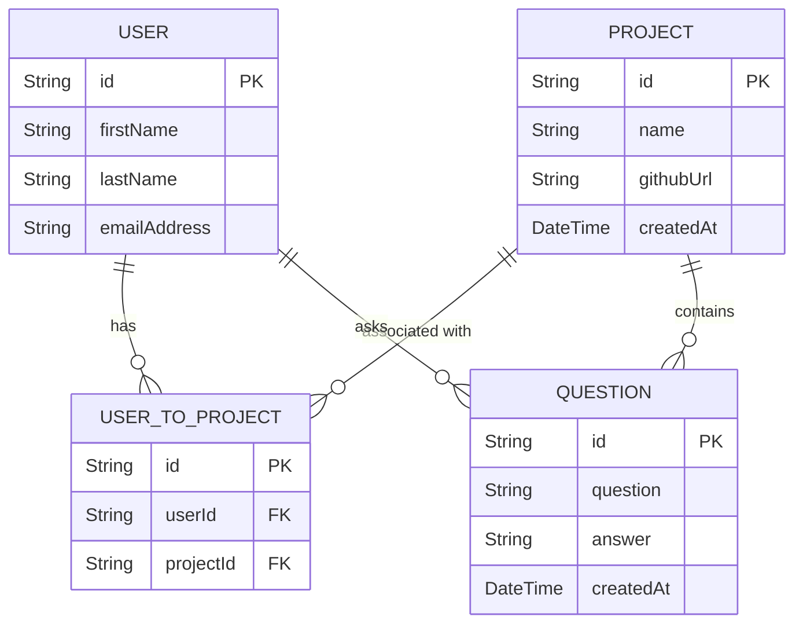

# StackAlchemy

A modern stack-based architecture for seamless application development and deployment.

## 📖 Overview

StackAlchemy offers a unified platform where developers can manage projects, index GitHub repositories, and interact with rich API endpoints. Built with robust transaction management and error handling, it securely integrates various services for project monitoring and deep code analysis.

## 🏗 Architecture



## 🔄 System Flow



## 🔍 Process Overview



## ✨ Features

- High Performance
- Enhanced Security
- Scalability
- Real-time Updates
- Easy Integration
- Monitoring & Analytics

## 🛠 Installation

```bash
git clone https://github.com/yourusername/stackalchemy.git
cd stackalchemy
npm install
```

## 🚀 Getting Started

1. Configure your environment:
```bash
cp .env.example .env
```

2. Start the development server:
```bash
npm run dev
```

## 📊 Component Structure



## 🧩 Database Schema Overview



## ⚙️ API Endpoints

- Create Project: Validates users, ensures no duplicate GitHub URLs, creates projects within a transaction, and indexes GitHub repositories.
- Get Commits: Polls and returns the commit history for a project.
- Save Answer: Stores user questions and corresponding answers alongside file references.
- Delete Project: Removes a project and its related records, ensuring system consistency.